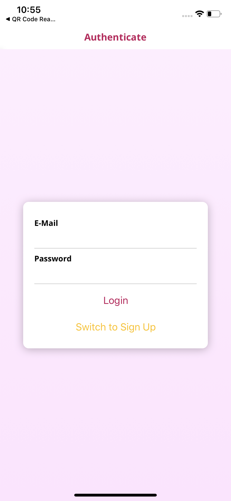
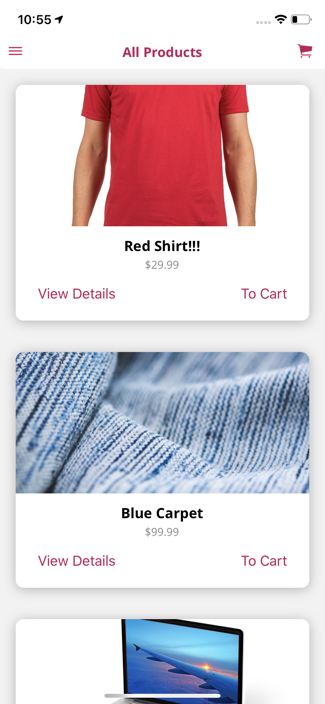
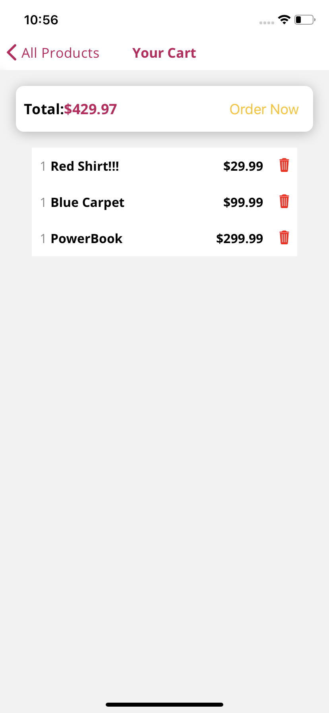
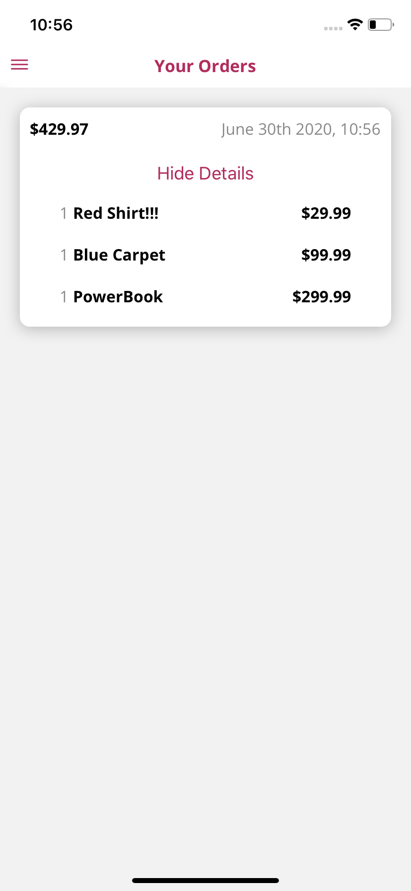

# shop-app
Basic shopping application build in react native

  

        
    
    
    
  

  

# How to Run App

  1. clone this repository  
  2. open cmd/terminal to clone repository folder  
  3. run `npm install` **on windows** or `sudo npm install` **on ios/linux**  
  4. run `npm start`

# install package 

1. `npm install --save redux react-redux react-navigation react-navigation-header-buttons`  
2. `expo install react-native-gesture-handler react-native-reanimated`  
3. `npm install react-navigation-stack @react-native-community/masked-view react-native-safe-area-context`  
4. `npm install react-native-screens`  
5. `npm install --save expo-font`  
6. `npm install --save-dev redux-devtools-extension`  
7. `npm install --save @expo/vector-icons`  
8. `npm install react-navigation-drawer`  
9. `npm install react-navigation`  
10. `npm install --save moment`  
11. `npm install --save redux-thunk`  
12. `npm install --save expo-linear-gradient`  
